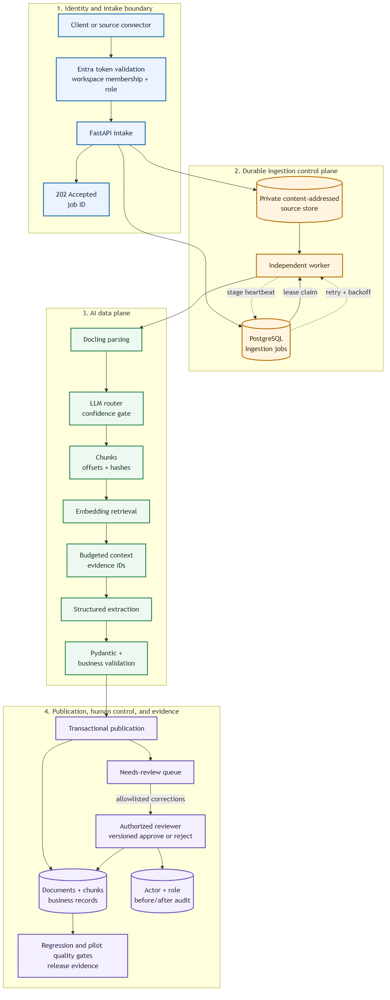

# FDE AI Data Harness Architecture

This folder contains the architecture diagram for the FDE AI data harness and instructions for exporting it. The diagram emphasizes the customer-data path: unstructured source material, governed text chunks, controlled model context, validated structured output, human review, provenance, and evaluation.

## Files
- `architecture.mmd` - Mermaid diagram source (single combined framework diagram).
- `architecture.svg` - primary vector architecture diagram for documentation and portfolio review.
- `architecture.png` - raster export for LinkedIn/project review and quick visual inspection.

## Diagram
The Mermaid source and checked-in SVG/PNG exports represent the same current
architecture.



## Reading the Diagram

The flow answers how a request becomes durable before work starts, how workers
recover from failure, how unstructured data becomes controlled model context,
and how only validated, evidence-linked output reaches the system of record.
Authentication and authorization code is implemented and tested; cloud app
registration and a real second-user test are still deployment evidence gaps.

## How to export to SVG, PDF, or PNG
Recommended: use `@mermaid-js/mermaid-cli` (`mmdc`).

Install (Node.js required):

```bash
npm install -g @mermaid-js/mermaid-cli
```

Export to PNG:

```bash
mmdc -i docs/architecture.mmd -o docs/architecture.png -w 1600 -H 1200
```

Export to SVG:

```bash
mmdc -i docs/architecture.mmd -o docs/architecture.svg -w 2200 -H 1200
```

Export to PDF:

```bash
mmdc -i docs/architecture.mmd -o docs/architecture.pdf
```

Alternative: open `docs/architecture.mmd` in VS Code with a Mermaid preview extension and export manually.

## Quick notes
- The diagram shows the text data lifecycle: source file -> parser -> normalization -> chunking contract -> embeddings -> retrieval -> context assembly -> structured extraction -> validation -> evidence-linked persistence -> evaluation.
- The architecture is intentionally centered on the FDE data problem: making customer-owned unstructured text usable, inspectable, testable, and safe enough to support a business workflow.
- The emphasis is harness engineering for unstructured text, not cloud infrastructure.

## How to read the diagram
1. **Document ingestion** receives a user-uploaded document and converts file bytes into normalized markdown text.
2. **Text data contract** turns that text into durable document and chunk records with hashes, offsets, token estimates, and stable chunk IDs.
3. **RAG and context harness** embeds chunks, routes the document type, retrieves task-specific evidence, and assembles model-ready context under a token budget.
4. **AI automation** uses specialized extraction agents and structured outputs, then validates the result with Pydantic schemas.
5. **Persistence and review** stores extracted records with source chunk IDs; incomplete records become `needs_review`. A reviewer can correct allowlisted fields and approve or reject, while optimistic version checks prevent stale decisions and an audit row preserves actor plus before/after values.
6. **Evaluation harness** checks router accuracy, field accuracy, status accuracy, and evidence coverage so prompt, model, and chunking changes can be judged with evidence.
