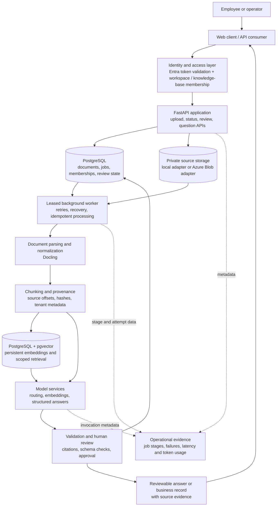
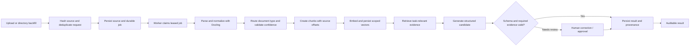
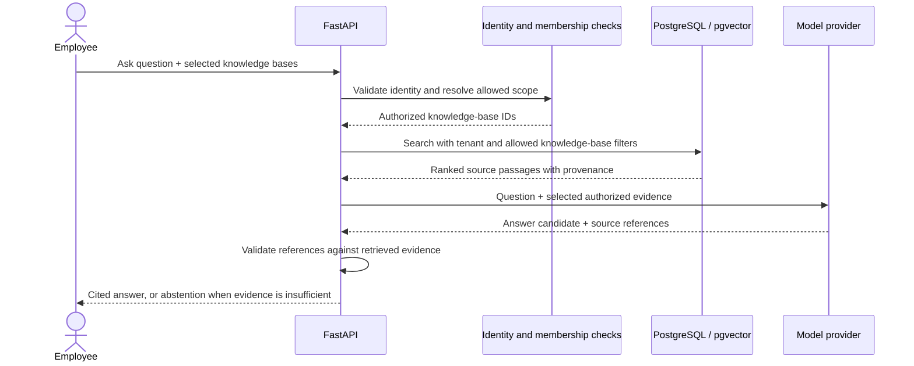

# Document Intelligence — System and Workflow Showcase

This page presents the system at the product and architecture level. It focuses
on the work moving through the system, the engineering skills behind it, and
the evidence available today. It does not publish application source, secrets,
or private model instructions.

> **Demo safety:** The interactive walkthrough uses a clearly labeled fictional
> risk standard. Do not upload customer, financial, or otherwise confidential
> documents to a public demo.

## What the system does

Document Intelligence turns files into reviewable, evidence-linked information.
It supports two related workflows:

1. **Document processing:** ingest one source, extract structured fields, check
   them against a schema, and send incomplete or uncertain results for review.
2. **Knowledge assistance:** search across the employee's authorized knowledge
   bases, answer from retrieved passages, and return citations that point back
   to the source document.

The model proposes content. Authorization, validation, persistence, and approval
remain controlled by application logic and the user workflow.

## System layers

### Layer responsibilities

| Layer | Responsibility | Representative technologies / skills |
|---|---|---|
| User and API | Upload documents, check progress, ask questions, review results | FastAPI, API contracts, request validation |
| Identity and authorization | Resolve the caller and limit access to a workspace and its knowledge bases | Microsoft Entra ID, JWT claim validation, membership-based authorization |
| Durable intake | Store source bytes and create recoverable processing work | PostgreSQL, content hashing, idempotency, private Azure Blob adapter |
| Workflow control | Run long tasks outside the request; recover expired work and handle retryable failures | PostgreSQL-backed jobs, worker leases, retry and recovery design |
| Document understanding | Parse files, normalize content, route document types, retain source lineage | Docling, format handling, chunk offsets and hashes |
| Retrieval | Store vectors and retrieve only evidence in the authorized scope | PostgreSQL, pgvector, embeddings, SQL authorization predicates |
| AI and validation | Produce structured candidates or grounded answers, then validate shape and evidence | OpenAI APIs, structured outputs, Pydantic, citation checks |
| Human review | Correct or approve uncertain output and preserve the decision history | Review workflow, optimistic concurrency, audit snapshots |
| Operations and evaluation | Inspect job health and model-call behavior; measure retrieval against a public baseline | Structured telemetry, CUAD, Recall@k, latency and token metrics |

## Workflow A — source document to reviewable record

The API accepts durable work and returns a job reference; the worker handles
parsing and model calls. Retryable failures can be retried without treating a
second request as a new source version. Results that need judgment remain
reviewable instead of being silently treated as complete.

## Workflow B — authorized question to cited answer

The application applies access scope as part of retrieval. The model receives
selected evidence for that request, not the entire document corpus. A proposed
external action remains a proposal until a human reviewer approves it.

## Azure and cloud boundary

| Capability | Current state | What that means |
|---|---|---|
| Private source storage | **Implemented adapter; cloud use needs deployment validation** | The storage interface supports local development and Azure Blob using Azure identity credentials. A real cloud identity and storage-access smoke test is still required. |
| PostgreSQL and pgvector | **Implemented in code; target-database rollout pending** | Migrations and a backfill path are present. The target Azure PostgreSQL server must permit the vector extension, then migrations and embedding backfill must be verified. |
| Entra identity | **Authorization code implemented and tested; cloud registration not verified** | Signed identity claims and membership checks are part of the application. A deployed app registration and real multi-user cloud test remain open evidence. |
| Full Azure application deployment | **Not established by this repository evidence** | Do not describe this project as a verified Azure production deployment. The Azure Blob integration path is implemented; end-to-end cloud operation still needs to be demonstrated. |

Cloud storage access is designed around managed identity rather than a storage
account key. The codebase does not, by itself, prove that the Azure resources,
permissions, network controls, monitoring, backup, or recovery drills have been
deployed and verified.

## Technical skills demonstrated

- **Workflow engineering:** turn slow, failure-prone model work into durable
  jobs with visible states, safe retries, and worker recovery.
- **Data engineering:** define source identity, parse heterogeneous files,
  normalize content, preserve provenance, and manage reprocessing.
- **Applied AI:** combine document routing, embeddings, retrieval, structured
  extraction, and evidence-grounded answers for distinct business tasks.
- **Backend engineering:** build API boundaries, typed schemas, persistent
  state, migrations, and review operations.
- **Security engineering:** bind access to verified identity and server-side
  membership; scope retrieval before evidence reaches model context.
- **Human-centered automation:** keep uncertain data reviewable and require
  approval before a proposed action crosses the application boundary.
- **Evaluation and operations:** track workflow and model-call outcomes, use a
  public retrieval benchmark, and state where pilot-quality evidence is still
  missing.
- **Cloud integration:** provide a private Azure Blob storage adapter and an
  identity-based access path, while distinguishing that code from a verified
  cloud deployment.

## Evidence and readiness limits

- The public CUAD lexical benchmark reports **80.50% BM25 Recall@5** over 510
  contracts and 2,292 positive evidence queries. This is a retrieval baseline,
  not an end-to-end answer-accuracy or production-quality score.
- The current end-to-end extraction set is too small to establish a pilot
  quality gate. A representative labeled customer corpus is still needed.
- PostgreSQL concurrency, full cloud latency and cost, availability, and a
  multi-user Entra deployment have not been established by the available
  evidence.
- No customer uptime, accuracy, or monthly-cost commitment should be inferred
  from the demo.

## Explore the repository

- [Public workflow walkthrough](https://document-intelligence-playground-jsu.sujy040913.chatgpt.site/)
- [Production review and evidence gaps](PRODUCTION_REVIEW.md)
- [Architecture and data flow](ARCHITECTURE.md)
- [Portfolio case study](PORTFOLIO_CASE_STUDY.md)
